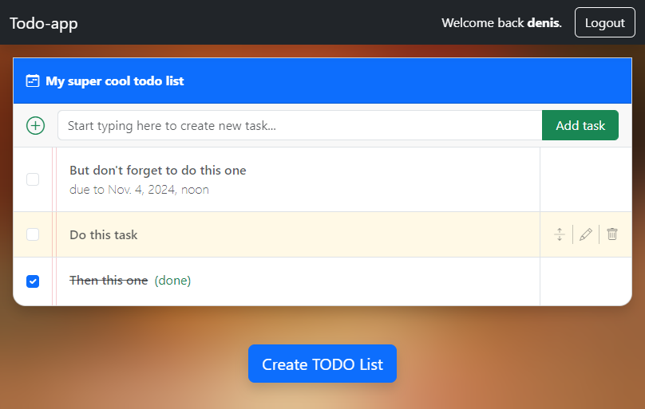

# TODO App

A simple todo app using Django, HTMX, Bootstrap and Alpine.js.

## Preview



## Features

- Create/update/delete projects
- Add tasks to your projects
- Update and delete tasks
- Prioritize tasks inside a project
- Choose deadline for your task
- Mark tasks as 'done'

## Installation

1. Clone the repository

    ```bash
    git clone https://github.com/dmitlenko/todo.git
    ```

2. Create `.env` file in the root directory. You can use [`.env.dist`](./.env.dist) as a template.

    > **Note:** Don't forget to generate a new `SECRET_KEY` for your `.env` file.
    > You can use [Djecrety](https://djecrety.ir/) to generate a new secret key.

3. Build and run docker containers

    ```bash
    docker-compose up -d
    ```

4. See the app running at [localhost](http://localhost/). This url is defined in your `.env` file.

## Development

### Requirements

- [Python 3.12](https://www.python.org/downloads/)
- [Poetry](https://python-poetry.org/)
- [Docker and Docker Compose](https://docs.docker.com/get-docker/)

### Installation

1. Clone the repository

    ```bash
    git clone https://github.com/dmitlenko/todo.git
    ```

2. Create `.env` file in the root directory. You can use [`.env.dist`](./.env.dist) as a template.

3. Install dependencies

    ```bash
    poetry install
    ```

4. Run the development database

    ```bash
    docker-compose -f docker-compose.dev.yaml up -d
    ```

4. Run the development server

    ```bash
    poetry run python -m todo.manage runserver
    ```

### Testing

To run tests, use the following command:

```bash
poetry run python -m todo.manage test
```

## License

This project is licensed under the MIT License - see the [LICENSE](LICENSE) file for details.

## Acknowledgments

- [Django](https://www.djangoproject.com/)
- [HTMX](https://htmx.org/)
- [Alpine.js](https://alpinejs.dev/)
- [Bootstrap](https://getbootstrap.com/)
